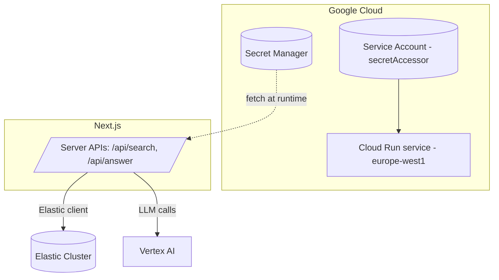
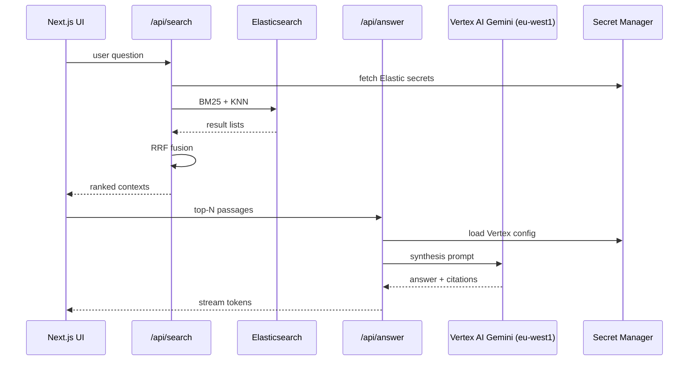

# 🧠 MindSieve — Research Assistant (Next.js Edition)

**Submission for the AI Accelerate Hackathon (Elastic Challenge).**  
**Stack:** Next.js · Elastic (BM25 + vectors) · Vertex AI (Gemini + `text-embedding-005`) · GSAP · Tailwind · shadcn/ui  
**Region:** Google Cloud **europe-west1** (Vertex AI + Cloud Run)

---

## 🧭 Architecture (Mermaid)

### System Flow
```mermaid
flowchart LR
  User[User] --> UI[Next.js UI - GSAP + shadcn]
  UI -->|query| API_Search[/api/search (hybrid)/]
  API_Search --> ES[(Elasticsearch BM25 + KNN)]
  ES -->|top k docs + chunks| API_Answer[/api/answer (Gemini)/]
  API_Answer --> Gemini[(Vertex AI Gemini\nregion: europe-west1)]
  API_Answer -.-> Secrets[(Secret Manager)]
  Gemini -->|citations + answer| UI
```

### Secrets & Runtime Access


### Retrieval & Fusion Pipeline

