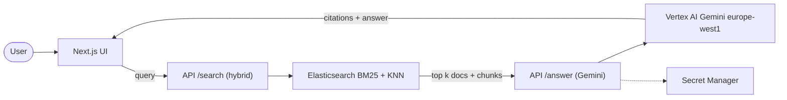
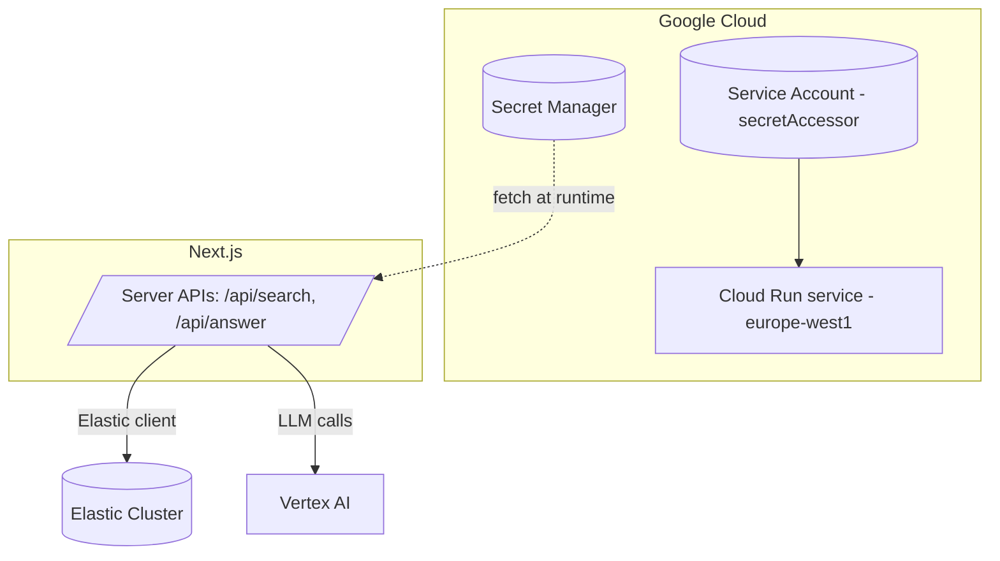
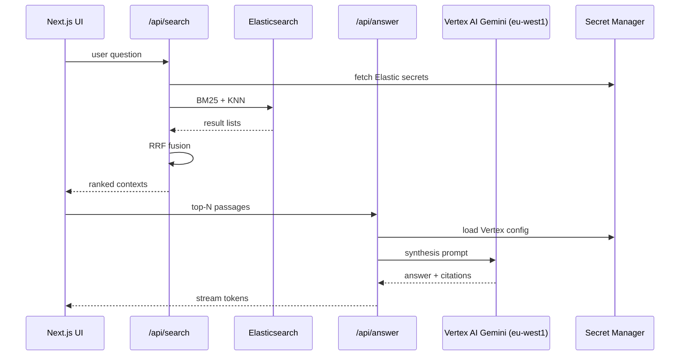

# 🧠 MindSieve — Research Assistant (Next.js Edition)

**Submission for the AI Accelerate Hackathon (Elastic Challenge).**  
**Stack:** Next.js · Elastic (BM25 + vectors) · Vertex AI (Gemini + `text-embedding-005`) · GSAP · Tailwind · shadcn/ui  
**Region:** Google Cloud **europe-west1** (Vertex AI + Cloud Run)

> _MindSieve turns literature review into a fast, delightful conversation. Ask complex questions, get sourced, synthesised answers with live citations._

---

|  |  |
| :-- | :-- |
| **🚀 Live Demo** | **[YOUR_DEPLOYED_URL_HERE]** |
| **🎬 Video Pitch (≤ 3 min)** | **[YOUTUBE_OR_VIMEO_URL]** |

> **Note on data**: The Elastic index is pre-filled with **arXiv Computer Science** articles and **dense embeddings from Vertex AI `text-embedding-005`**. (Backfill scripts are not part of this README.)

---

## ✨ Why MindSieve
- Traditional keyword search misses concept-level matches and forces you to skim PDFs. 
- MindSieve performs **hybrid retrieval** (BM25 + dense vectors) and **LLM synthesis** to produce concise, **cited** answers you can trust.
- Built as a **slick, demo‑ready Next.js app** with tasteful **GSAP micro‑interactions** (no chat‑bot fatigue).

## 🔧 What’s new in the Next.js version
- **App Router** (`app/`) with API routes for search/synthesis.
- **GSAP** motion on hero, cards, and results reveal.
- **shadcn/ui** + Tailwind for modern UI.
- **Server Actions / Edge‑ready** handlers (optional), streaming tokens to the UI.

---

## 🧭 Architecture (Mermaid)

### System Flow


### Secrets & Runtime Access


### Retrieval & Fusion Pipeline


---

## 🛠️ Tech Stack
- **UI:** Next.js (App Router), Tailwind, shadcn/ui, GSAP
- **Search:** Elasticsearch (hybrid: BM25 + vector KNN), RRF merging
- **LLM:** Vertex AI **Gemini 2.5 Pro** (answer synthesis, query understanding)
- **Embeddings:** Vertex AI **`text-embedding-005`** (already backfilled for arXiv CS)
- **Deploy:** Cloud Run (europe-west1)

---

## ⚙️ Quickstart

### Prerequisites
- Node.js **18+**
- An **Elasticsearch** endpoint (with `arxiv-cs` index containing documents + embeddings)
- **Google Cloud** project with Vertex AI & Secret Manager enabled

### 1) Install
```bash
pnpm i
```

### 2) Configure environment with **Secret Manager**
Use **Google Secret Manager** for sensitive values. Non-sensitive constants (like region) live in code.

**Create secrets:**
```bash
gcloud services enable secretmanager.googleapis.com run.googleapis.com aiplatform.googleapis.com --project $GCP_PROJECT_ID

echo -n "https://<your-elastic-host>" | gcloud secrets create elastic-url --data-file=- --replication-policy="automatic" --project $GCP_PROJECT_ID
echo -n "<ELASTIC_API_KEY>" | gcloud secrets create elastic-api-key --data-file=- --replication-policy="automatic" --project $GCP_PROJECT_ID
echo -n "arxiv-cs" | gcloud secrets create elastic-index --data-file=- --replication-policy="automatic" --project $GCP_PROJECT_ID
echo -n "gemini-2.5-pro" | gcloud secrets create vertex-model --data-file=- --project $GCP_PROJECT_ID
```

**Grant access to Cloud Run SA:**
```bash
SA_EMAIL="mindseive-runner@${GCP_PROJECT_ID}.iam.gserviceaccount.com"
gcloud iam service-accounts create mindseive-runner --display-name="MindSieve Runner" --project $GCP_PROJECT_ID || true
gcloud projects add-iam-policy-binding $GCP_PROJECT_ID --member serviceAccount:${SA_EMAIL} --role roles/secretmanager.secretAccessor
```

### 3) Run dev server
```bash
pnpm dev
# App on http://localhost:3000
```

---

## 🚀 Deploy (Cloud Run, europe-west1)
```bash
gcloud builds submit --tag europe-west1-docker.pkg.dev/$GCP_PROJECT_ID/mindsieve/web:latest

gcloud run deploy mindsieve-web   --image=europe-west1-docker.pkg.dev/$GCP_PROJECT_ID/mindsieve/web:latest   --platform=managed   --region=europe-west1   --allow-unauthenticated   --service-account=mindseive-runner@${GCP_PROJECT_ID}.iam.gserviceaccount.com   --set-env-vars=NODE_ENV=production,GCP_PROJECT_ID=$GCP_PROJECT_ID,VERTEX_LOCATION=europe-west1,VERTEX_MODEL=gemini-2.5-pro,EMBEDDING_MODEL=text-embedding-005
```

---

## 🗺️ Roadmap
- Multi‑turn memory with query rewriting.
- Broader sources (PubMed, Springer, Crossref) via connectors.
- Profiles & Collections: save queries, export bibliographies.
- Evaluation harness: nDCG@k for retrieval and citation fidelity checks.

---

## 📄 License
MIT (or your preferred license)

---

## 🙌 Credits
- Elastic for the hybrid search challenge  
- Google Vertex AI for Gemini + embeddings  
- arXiv for open access research
